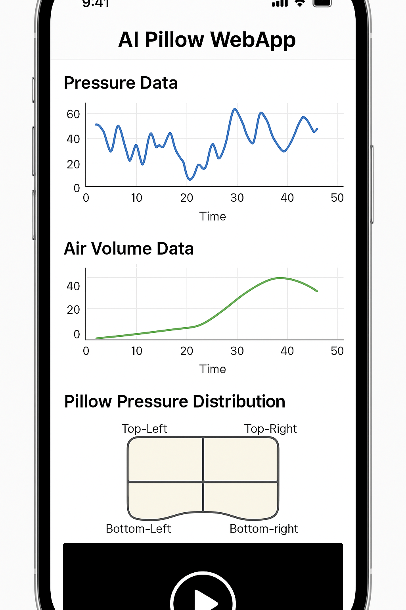
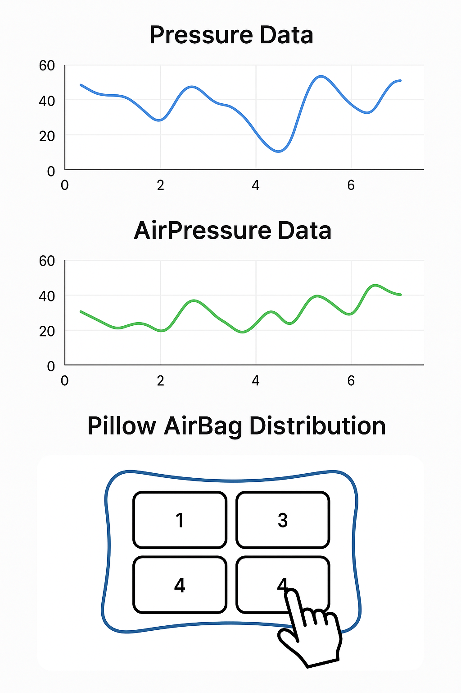

# ai-pillow-webapp

本リポジトリは、**AI枕プロジェクト**において  
- 保存されているCSVによる圧力・空気圧データのWeb可視化  
- Unityシミュレーション動画のWeb埋め込み  
- 枕の空気袋セグメント操作によるPython制御連携  
を実現する **Webアプリケーション** です．

このWebアプリは，睡眠中の状態をリアルタイムで把握し，個人最適化された枕制御アルゴリズムの研究と開発効率向上を目的としています．

---

## 🚀 仕様

### 🎯 目的

- 圧力センサ・空気圧データを **CSVから読み込み、時系列グラフで可視化**
- **Unityで開発したシミュレーション動画**をWeb上で表示
- **空気袋のセグメントをタッチ操作**し，その入力をPython側にJSON形式で送信することでAI枕の空気圧を調整（今回は対応する空気袋のセグメントの数値を送るだけで良い，ハードウェアが動くかどうかは確認する必要はない）

---

### 📄 入力

- **CSVファイル**  
  - `Pressure`, `AirPressure`, などの時系列データを含む
- **Unityシミュレーション動画ファイル**（MP4）
- ユーザのタッチ操作（セグメントID）

---

### 🧑‍💻 出力

- **折れ線グラフ／ヒートマップ**：圧力や空気圧の変化をWeb上に可視化
- **Unity動画のWeb埋め込み**：シミュレーション結果をブラウザで確認
- **Python API連携**：ユーザ操作をリアルタイムでサーバー側（Pythonプログラム）に送信する

---

### 🔧 実行環境
- Webのフロント・バックエンドについては任せます．
- Python 3.11.9
- 仮想環境（venv）での実行を推奨

---

### 🖼️ 出力イメージ例

  
  

---

## ライセンス
MIT License

## 開発者
佐藤 光河（Koga Sato）