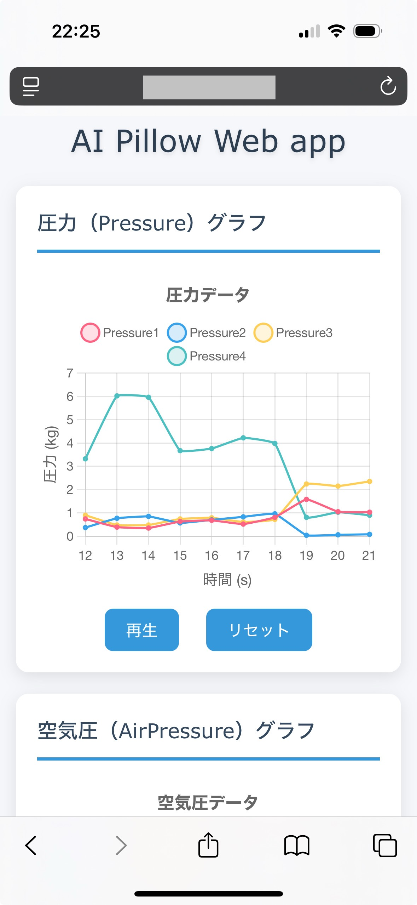
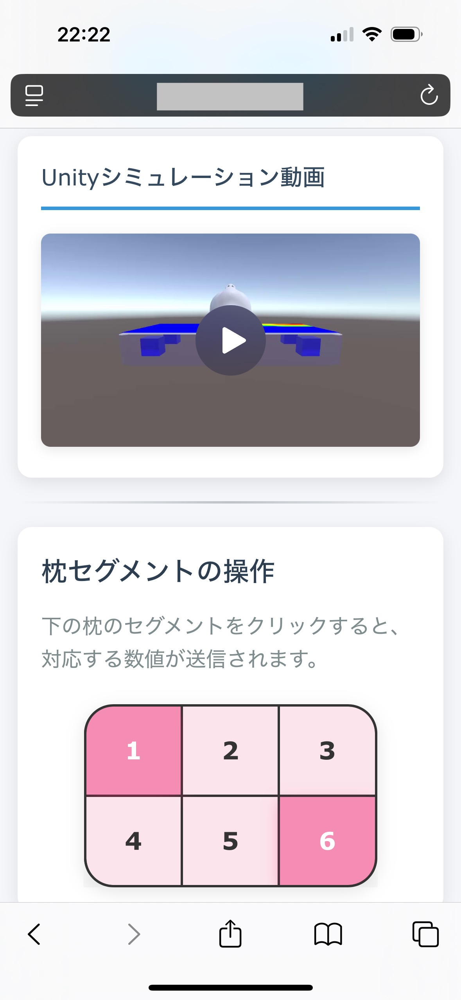

# ai-pillow-webapp

本リポジトリは、**AI枕プロジェクト**において  
- 保存されているCSVによる圧力・空気圧データのWeb可視化  
- Unityシミュレーション動画のWeb埋め込み  
- 枕の空気袋セグメント操作によるPython制御連携  
を実現する **Webアプリケーション** です．

このWebアプリは，睡眠中の状態をリアルタイムで把握し，個人最適化された枕制御アルゴリズムの研究と開発効率向上を目的としています．

---

## 🚀 仕様

### 🎯 目的

- 圧力センサ・空気圧データを **CSVから読み込み、時系列グラフで可視化**
- **Unityで開発したシミュレーション動画**をWeb上で表示
- **空気袋のセグメントをタッチ操作**し，その入力をPython側にJSON形式で送信することでAI枕の空気圧を調整（今回は対応する空気袋のセグメントの数値を送るだけで良い，ハードウェアが動くかどうかは確認する必要はない）

---

### 📄 入力

- **CSVファイル**  
  - `Pressure`, `AirPressure`, などの時系列データを含む
- **Unityシミュレーション動画ファイル**（MP4）
- ユーザのタッチ操作（セグメントID）

---

### 🧑‍💻 出力

- **折れ線グラフ／ヒートマップ**：圧力や空気圧の変化をWeb上に可視化
- **Unity動画のWeb埋め込み**：シミュレーション結果をブラウザで確認
- **Python API連携**：ユーザ操作をリアルタイムでサーバー側（Pythonプログラム）に送信する

---

### 🔧 実行環境
- Webのフロント・バックエンドについては任せます．
- Python 3.11.9
- 仮想環境（venv）での実行を推奨

---

### 📦 環境構築

#### ステップ1: プロジェクトをダウンロードする
まず、Gitを使ってリポジトリを自分のPCにコピー（クローン）します。

```
git clone https://github.com/U-22-Programming-Contest/ai-pillow-webapp.git
```

#### ステップ2: Windowsで仮想環境を作成して有効化する
次に、このプロジェクト専用のPython環境を新しく作ります。

[Python 3.11.9](https://www.python.org/downloads/release/python-3119/) をインストールして次のコマンドを実行します。

仮想環境を作成
```
py -3.11 -m venv .venv
```

仮想環境を有効化(PowerShellだとエラーが出るので、Command Promptで実行してください。)
```
.venv\Scripts\activate
```

#### ステップ3: ライブラリを一括インストールする
最後に、requirements.txt を使って、プロジェクトに必要なライブラリをすべてインストールするために次のコマンドを実行します。
```
pip install -r requirements.txt
```

pipが requirements.txt の中身を読み込み、記載されているライブラリ（それらが依存する他のライブラリ）を自動で仮想環境にインストールしてくれます。

---

### 🌐 Webサイトを開く
#### サーバーを起動（ローカルで確認）
次のコマンドでローカルサーバーを起動します。
```
uvicorn main:app --reload
```
そして、
http://127.0.0.1:8000
にアクセスすると、Webサイトを開けます。

#### 外部(スマホなど)からアクセスしたい場合
次のコマンドでサーバーを起動します。
```
uvicorn main:app --reload --host 0.0.0.0
```

そして、同じWi-Fiに接続した端末(スマホ等)から
http:// xxx.xxx.xxx.xxx:8000
(xxx.xxx.xxx.xxx はサーバを起動したPCのIPアドレス)
にアクセスすると、外部からWebサイトを開けます。

PCのIPアドレスを確認する場合は次のコマンドを実行します。

```
ipconfig
``` 

---

### 🖼️ 出力イメージ例
<p align="center">
  
  
</p>

---

## ライセンス
MIT License

## 開発者
佐藤 光河（Koga Sato）